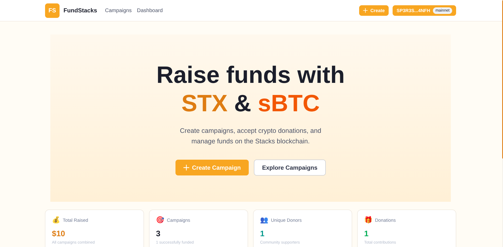

<p align="center">
  
</p>

<h1 align="center">FundStacks</h1>

<p align="center">
  <strong>Decentralized crowdfunding on Stacks — powered by STX and sBTC</strong>
</p>

<p align="center">
  <a href="#features">Features</a> •
  <a href="#how-it-works">How It Works</a> •
  <a href="#getting-started">Getting Started</a> •
  <a href="#for-developers">For Developers</a> •
  <a href="#contributing">Contributing</a>
</p>

---

## 🚀 What is FundStacks?

FundStacks is an open-source, decentralized crowdfunding platform built on the [Stacks](https://stacks.co) blockchain. Create campaigns, accept donations in **STX** or **sBTC**, and manage funds transparently — all secured by Bitcoin.

Whether you're raising funds for a community project, supporting a cause, or launching your next big idea, FundStacks makes it simple and trustless.

## ✨ Features

- **Create Campaigns** — Set a funding goal and start accepting donations in minutes
- **Dual Currency Support** — Accept both STX and sBTC donations
- **Transparent & Trustless** — All transactions are recorded on-chain
- **Real-time Updates** — See donations and progress as they happen
- **Mobile Friendly** — Fully responsive design works on any device
- **Wallet Integration** — Connect with Hiro Wallet, Xverse, or Leather

## 🔄 How It Works

1. **Connect Your Wallet** — Use any Stacks-compatible wallet
2. **Create a Campaign** — Set your goal, add a description, and launch
3. **Share & Collect Donations** — Donors contribute STX or sBTC directly to your campaign
4. **Withdraw Funds** — Once funded, withdraw directly to your wallet

All campaign logic is handled by smart contracts on the Stacks blockchain, ensuring transparency and security.

## 🏁 Getting Started

### For Campaign Creators

1. Visit the live app at **[your-deployment-url.com]**
2. Connect your Stacks wallet
3. Click "Create Campaign"
4. Fill in your campaign details and funding goal
5. Share your campaign link and start collecting donations!

### For Donors

1. Browse campaigns on the homepage
2. Click on a campaign to view details
3. Connect your wallet and click "Donate"
4. Choose your amount in STX or sBTC
5. Confirm the transaction in your wallet

## 👩‍💻 For Developers

### Prerequisites

- Node.js 18+
- npm or yarn
- A Stacks wallet (for testing)

### Local Development

```bash
# Clone the repository
git clone https://github.com/your-username/fundraising-dapp.git
cd fundraising-dapp

# Install dependencies
npm install

# Set up environment variables
cp front-end/.env.example front-end/.env.local

# Start the development server
cd front-end
npm run dev
```

Visit `http://localhost:3000` to see the app.

### Project Structure

```
fundraising-dapp/
├── clarity/           # Smart contracts (Clarity)
├── front-end/         # Next.js frontend
├── indexer/           # Event indexer (Node + PostgreSQL)
└── chainhooks/        # Chainhook configuration
```

### Smart Contracts

The fundraising logic is powered by Clarity smart contracts:

- **Campaign Creation** — Initialize campaigns with funding goals
- **Donations** — Accept and track contributions in STX/sBTC
- **Withdrawals** — Campaign owners withdraw funds upon completion
- **Refunds** — Donors can be refunded if campaign is cancelled

### Indexer Setup

For production deployments, the indexer tracks blockchain events:

```bash
cd indexer
cp .env.example .env
npm install
npm run build
npm run db:migrate
npm run dev
```

See the [Indexer README](./indexer/README.md) for detailed configuration.

## 🤝 Contributing

We welcome contributions! Here's how you can help:

1. **Fork** the repository
2. **Create** a feature branch (`git checkout -b feature/amazing-feature`)
3. **Commit** your changes (`git commit -m 'Add amazing feature'`)
4. **Push** to the branch (`git push origin feature/amazing-feature`)
5. **Open** a Pull Request

Please read our contributing guidelines before submitting PRs.

## 📜 License

This project is open source and available under the [MIT License](LICENSE).

## ⚠️ Disclaimer

This software is provided for educational and demonstration purposes. The smart contracts have not been professionally audited. Use at your own risk when deploying to mainnet with real funds.

---

<p align="center">
  Built with ❤️ on <a href="https://stacks.co">Stacks</a>
</p>
